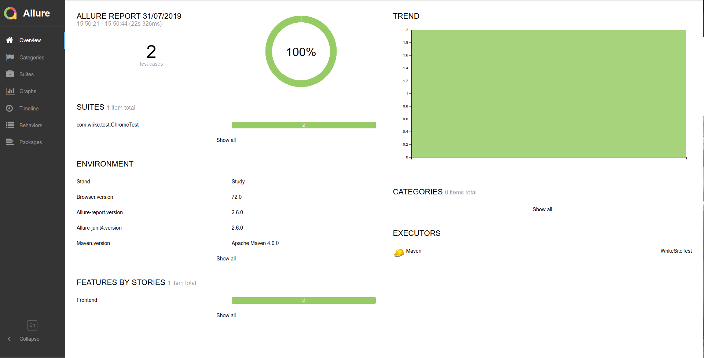

# WrikeSiteTest
This project tests some abilities of wrike.com site:
* Start working with company via email
* Company twitter page redirect

These two things can be tested independently, so It was decided to make two separate test scenarios.

Testing platform configuration:
* OS version: Linux Mint x64
* JDK version: jdk1.8.0_191
* Maven version: Apache Maven 4.0.0
* Allure-junit4 version: 2.6.0
* Allure-report version: 2.6.0
* Browser: Chrome
* Browser version: 72.0

Test report examples

